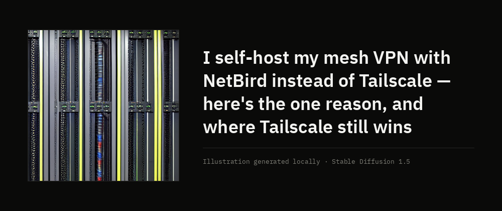
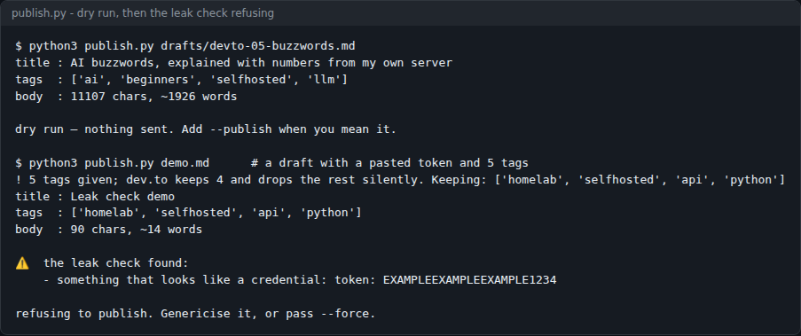
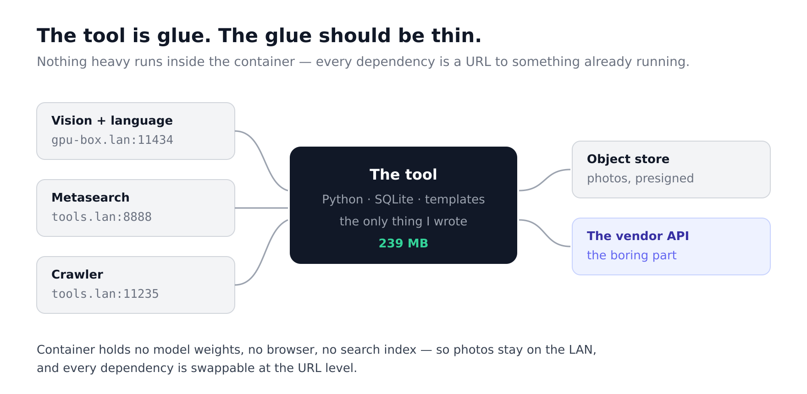
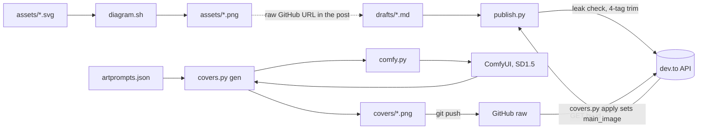

# blog-kit

Write technical posts as files, illustrate them, and publish them to dev.to from a terminal — with a leak check that refuses to send private IPs or credentials.



*A real cover from this repo (`covers/v2-4593582.png`): the inset is generated locally with Stable Diffusion 1.5, the title and credit are laid out by `covers.py`.*

 

## Contents

- [What it does](#what-it-does)
- [Screenshots](#screenshots)
- [Quick start](#quick-start)
- [Usage](#usage)
- [Configuration](#configuration)
- [How it works](#how-it-works)
- [Status, limits and real results](#status-limits-and-real-results)
- [Licence and credits](#licence-and-credits)

## What it does

- **Publishes a front-matter Markdown file to dev.to** over the Forem API (`publish.py`). It is a dry run unless you type `--publish`.
- **Refuses to publish leaks.** Before anything is sent, the body is checked for private IPv4 ranges (10/8, 127/8, 172.16/12, 192.168/16), `key=`/`token:`-style credentials and `sk-` API keys. A hit stops the run unless you pass `--force`.
- **Catches dev.to's silent tag drop.** dev.to keeps four tags and discards the rest without an error; `publish.py` warns and trims to four itself.
- **Confirms the post is live.** dev.to returns `"published": null` on a successful create, so the script re-reads the article and prints its `published_at`.
- **Turns hand-written SVG into 2x PNG** for embedding (`diagram.sh`, via `rsvg-convert`).
- **Makes 1000x420 cover banners** (`covers.py`): a 512x512 inset generated on a local ComfyUI, composed with the article title, saved under a new filename each time, and set as the article's cover through the API.
- **Keeps the sources in git**: drafts in `drafts/`, diagrams (SVG and PNG) in `assets/<post>/`, covers and their prompts in `covers/` and `artprompts.json`.

## Screenshots



*`publish.py` run on a real draft in `drafts/`, then on a throwaway file containing five tags and a fake token. Captured 2026-10-08.*



*A diagram made with `diagram.sh` (`assets/internal-tool/01-glue.svg` to `.png`). Hostnames are genericised (`gpu-box.lan`) on purpose.*

## Quick start

Prerequisites: Python 3 (`publish.py` uses the standard library only). For diagrams, `rsvg-convert` from `librsvg2-bin`.

```bash
git clone https://github.com/casareanderson/blog-kit.git
cd blog-kit
python3 publish.py drafts/devto-05-buzzwords.md
```

Success looks like the title, the tags and a word count, ending in:

```
dry run — nothing sent. Add --publish when you mean it.
```

Nothing has left your machine at this point. No API key is needed for a dry run.

## Usage

**Publish a post.**

```bash
export DEVTO_API_KEY=...                         # dev.to → Settings → Extensions → DEV Community API Keys
python3 publish.py drafts/my-post.md             # dry run: shows what would be sent
python3 publish.py drafts/my-post.md --publish   # creates the article and publishes it
python3 publish.py drafts/my-post.md --publish --id 12345   # updates an existing article
```

The front matter it reads:

```yaml
---
title: "The hard part of an internal tool isn't the API. It's the second user."
description: "One sentence for the card and the search result."
tags: selfhosted, api, architecture, webdev
---
```

`publish.py` uses `title`, `description` and `tags`. Other keys (the drafts carry `published: false` as a note to self) are ignored: `--publish` is the only switch, and an article it sends is published.

**Render a diagram.**

```bash
./diagram.sh assets/internal-tool/01-glue.svg        # writes 01-glue.png at 1760px wide
./diagram.sh assets/internal-tool/01-glue.svg 1200   # or pick a width
```

Author the SVG at 880px and give it an explicit white background: dev.to has a dark mode, and a transparent PNG with dark text disappears in it.

**Make covers** (needs the extra setup in the table below).

```bash
python3 covers.py gen 4593582          # generate the inset and compose covers/4593582.png
python3 covers.py apply 4593582        # set it as that article's cover via the API
python3 covers.py gen-file KEY "TITLE" "PROMPT"   # cover for a queued post with no id yet;
                                                  # commits + pushes covers/pre-KEY.png, prints its raw URL
```

Running `covers.py` with no command, or an unknown one, prints the usage and does nothing.

## Configuration

| Name | Where | Default | What it does |
|---|---|---|---|
| `DEVTO_API_KEY` | env, `publish.py` | none | dev.to API key. Required only with `--publish`; there is no fallback. |
| `--force` | `publish.py` flag | off | Publish even when the leak check finds something. |
| `--id` | `publish.py` flag | `0` | Update this article id instead of creating a new one. |
| width (2nd arg) | `diagram.sh` | `1760` | Output PNG width in pixels. |
| `HOST` | `comfy.py` | `http://127.0.0.1:8188` | ComfyUI server used for cover insets. |
| `CKPT` | `comfy.py` | `v1-5-pruned-emaonly.safetensors` | Checkpoint ComfyUI loads. |
| `FONT_DIR` | `covers.py` | `/usr/share/fonts/truetype/ibm-plex` | IBM Plex Sans/Mono for banner text. |
| `REPO`, `BRANCH` | `covers.py` | `casareanderson/blog-kit`, `main` | Where covers are pushed; dev.to is given the raw GitHub URL. |
| `_style`, `_negative`, `<id>.p` | `artprompts.json` | — | Style suffix, negative prompt, and the per-article prompt. |

`covers.py` gets the dev.to key from the author's own secret resolver (`hermes_secrets`, loaded from `/opt/hermes-agent`). On another machine, replace the two `hs.get(...)` calls with `os.environ["DEVTO_API_KEY"]`.

## How it works



- **Publishing.** `publish.py` parses the front matter with a small regex (no YAML library), runs the leak check, then POSTs or PUTs to `https://dev.to/api/articles`. Every request sends a browser User-Agent: dev.to answers a bare `urllib` request with `403 Forbidden Bots` before it looks at the key.
- **Covers.** `comfy.py` submits a fixed txt2img workflow (512x512, 30 steps, `dpmpp_2m`/`karras`) and polls `/history/<prompt_id>`. The seed comes from the article id, so a rebuild gives the same image. `covers.py` fits the inset into a 300px square without cropping, shrinks the title font (40px down to 24px) until it fits in four lines, and adds a credit line saying the image is generated.
- **Why covers get new filenames.** dev.to proxies and caches cover images by URL, so replacing a file at the same path keeps showing the old one. `apply` reads the filename from `covers/manifest.json`, skips articles already pointing at their file, spaces writes 12 seconds apart and backs off on HTTP 429.
- **Older path.** `covers.py build` and `recompose` pick public-domain paintings from the Met Museum API and score each candidate against its own metadata, because the Met's search is not relevance-ranked. All 21 covers in the current manifest use the generated path instead.

```
blog-kit/
├── publish.py          # Markdown → dev.to, dry run by default, leak check
├── diagram.sh          # SVG → 2x PNG with rsvg-convert
├── covers.py           # cover banners: gen, gen-file, apply, build, recompose, push
├── comfy.py            # minimal ComfyUI txt2img client
├── artprompts.json     # per-article image prompts + shared style/negative
├── artqueries.json     # search terms for the Met Museum path
├── covers/             # composed banners + manifest.json
├── drafts/             # posts as Markdown with front matter
├── assets/<post>/      # each post's diagrams, SVG and PNG side by side
└── docs/ENDPOINTS.md   # dev.to API calls and the traps, measured
```

## Status, limits and real results

- In use for the author's own dev.to posts. `covers/manifest.json` lists 21 articles with generated covers; `covers/` holds 58 files including superseded versions and covers for queued posts.
- The leak check is a set of regexes, not a scanner. It catches private IPv4 addresses and the credential shapes listed above. It does not catch hostnames, email addresses, IPv6 or names of people — check those yourself. `docs/ENDPOINTS.md` explains why the check exists.
- `publish.py` only creates published articles. To unpublish, PUT `{"article":{"published":false}}` (see `docs/ENDPOINTS.md`).
- `covers.py` is wired to this author's setup: a local ComfyUI, IBM Plex fonts at a fixed path, a secret resolver outside this repo, and pushes to this repository. Expect to edit the constants at the top.
- SD1.5 renders hardware and objects well and text badly, which is why the prompts in `artprompts.json` avoid screens with legible UI.
- No tests.

The API notes in [docs/ENDPOINTS.md](docs/ENDPOINTS.md) were measured against the live dev.to API: the bot block, the body-less list endpoint, the `null` publish flag and the silent tag drop.

Posts written with this kit are at [dev.to/c1-anderson](https://dev.to/c1-anderson), for example [The hard part of an internal tool isn't the API. It's the second user.](https://dev.to/c1-anderson/the-hard-part-of-an-internal-tool-isnt-the-api-its-the-second-user-573h), whose diagrams are in `assets/internal-tool/`.

## Licence and credits

MIT — see [LICENSE](LICENSE).

- Cover insets: generated locally with Stable Diffusion 1.5 (`v1-5-pruned-emaonly`, CreativeML OpenRAIL-M licence) through [ComfyUI](https://github.com/comfyanonymous/ComfyUI) (GPL-3.0). Each banner says so in its credit line.
- Banner type: [IBM Plex](https://github.com/IBM/plex) (SIL Open Font License 1.1).
- Painting path: [The Metropolitan Museum of Art Open Access API](https://metmuseum.github.io/), public-domain (CC0) images.
- Diagrams: [librsvg](https://gitlab.gnome.org/GNOME/librsvg) (`rsvg-convert`, LGPL-2.1).
